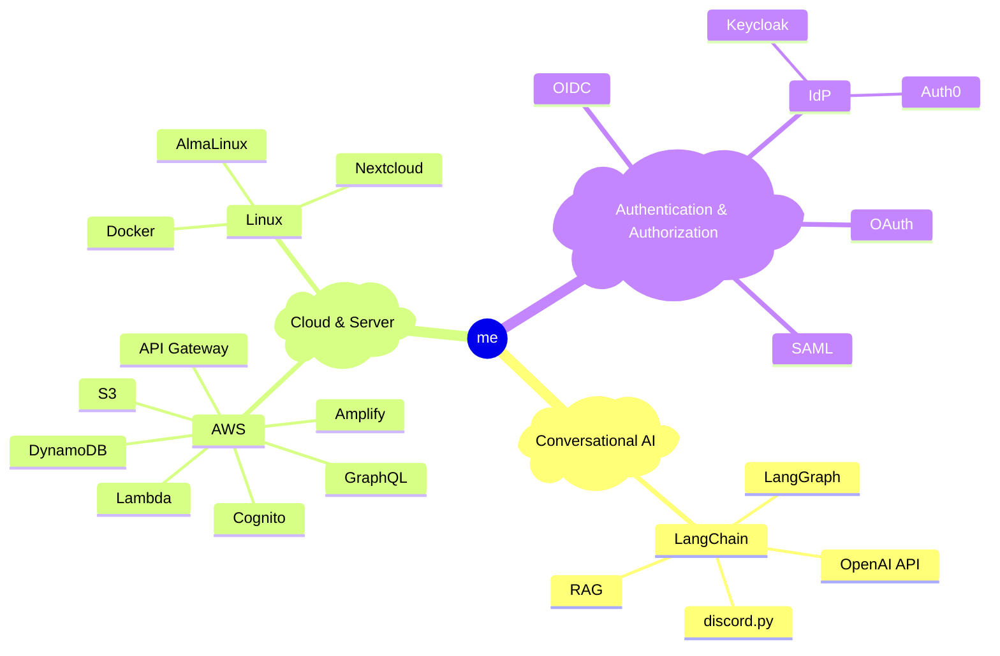

# こんにちは/Hello/你好 👋

## 🧑‍💻 About Me
- 3rd-year undergraduate student in the Faculty of Information Science
- Passionate about **building dialogue AI systems** and **deploying scalable cloud services**
- Also working as a Music Creator/Mix Engineer

## 💡 Current Interests and Experience

## 🛠️ Tech Stack
- **Languages**: Python, Java, JavaScript/TypeScript, PHP, SQL, Bash
- **Frameworks**: Next.js (React), Laravel, FastAPI
- **Tools**: Git/GitHub, Docker, VS Code, Xcode

## 🌱 Currently Learning
- Retrieval-Augmented Generation (RAG) and large language model (LLM) agents
- MLOps and serverless architectures for scalable AI services
- Security best practices for identity and access management

<!--
**Lunamikan/lunamikan** is a ✨ _special_ ✨ repository because its `README.md` (this file) appears on your GitHub profile.

Here are some ideas to get you started:

- 🔭 I’m currently working on ...
- 🌱 I’m currently learning ...
- 👯 I’m looking to collaborate on ...
- 🤔 I’m looking for help with ...
- 💬 Ask me about ...
- 📫 How to reach me: ...
- 😄 Pronouns: ...
- ⚡ Fun fact: ...
-->
